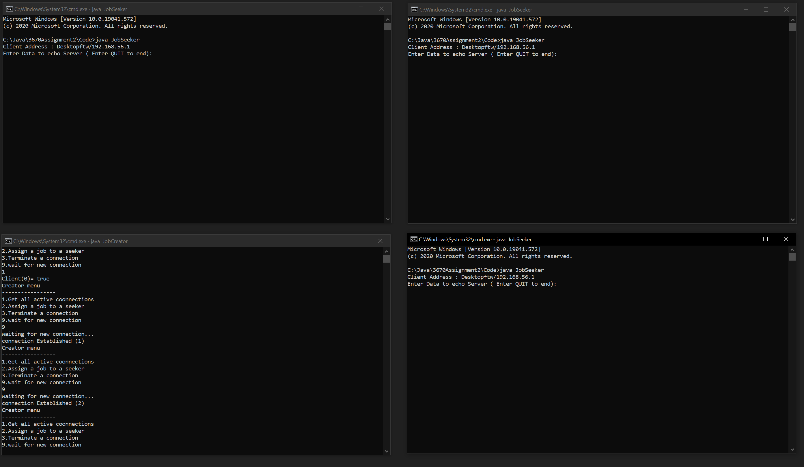
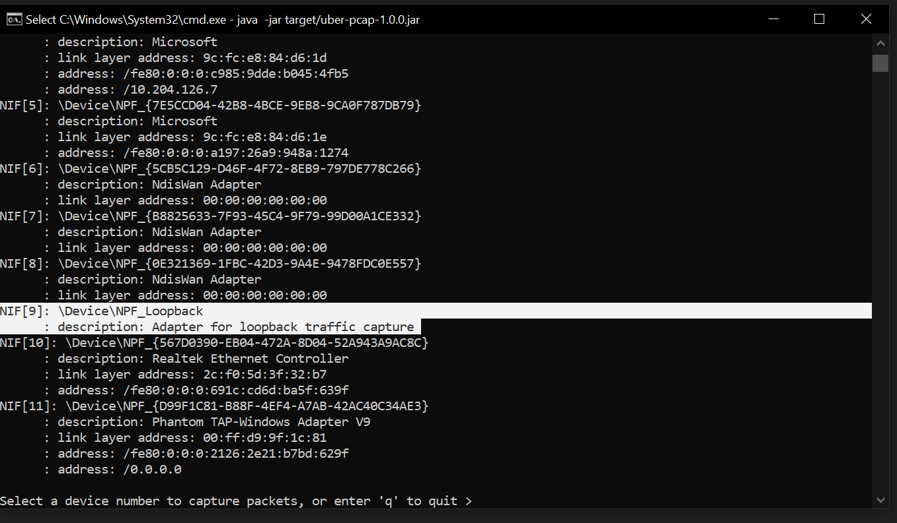

# 3670Assignment2/Assignment3
Submission for group 11
## How to run?
### For Assignment 2
Compile JobCreator.java and JobSeeker.java using command prompt.
```bash
javac JobCreator.java
javac JobSeeker.java
```
and then run it using these commands (in order).
```bash
java JobCreator
java JobSeeker
```
The line "java JobSeeker" can be run many times. (Each Jobseeker is a client)
### For Assignment 3
Follow "Using pcap4j.pdf" to set up the Maven development environment on your system.
## How to use? (Assignment 2)

**Step 1:** Run JobCreator


**Step 2:** Run JobSeeker in a new command prompt window


**Step 3:** You can also run multiple JobSeekers to connect to the same JobCreator, or you can skip this step.




**Step 4:** You can view the current connections to the JobCreator by choosing option "1" on the JobCreator command window.


**Step 5:** Now, you can assign jobs to any connect JobSeeker by selecting option "2" and selecting a free client.


After any client is done with it's assigned job, it will send a confirmation string to the JobCreator to be displayed


## How to use? (Assignment 3)

**Step 1:** Open a new command prompt window from the pcap4j directory and execute these lines to start capturing packets.

```bash
mvn package
java -jar target/uber-pcap-1.0.0.jar
```
**Step 2:** Choose the device which has the description "Adapter for loopback traffic capture" to view TCP packet traffic on port 4445 only and UDP traffic.



**Step 3:** One to one jobs will now have 2 new jobs which can be assigned, and a new menu option has been created for one to many jobs. TCP and UDP attacks on the JobCreator's IP address and port 4445 can be seen on the pcap4j terminal on the top left.


## Additional Information

At any time during the execution, the JobSeeker can terminate connection by entering ctrl-c on their command window. The JobCreator is also able to terminate any unwanted connection by using menu option "3". More steps to be added soon.
